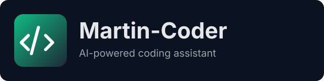

# Martin-Coder

<div align="center">



**AI-Powered Code Generation, Editing, and Debugging Platform**

[](https://opensource.org/licenses/MIT)
[](https://www.python.org/downloads/)
[](https://nodejs.org/)

[English](#english) | [Español](#español)

</div>

---

## English

### Overview

Martin-Coder is a comprehensive AI-powered development platform that combines the capabilities of multiple Large Language Models (LLMs) to assist with code generation, editing, debugging, and project management. It supports both cloud-based providers (Claude, OpenAI) and local models (LM Studio, Ollama).

### Key Features

- **Multi-LLM Support**: Claude, OpenAI, LM Studio (local), and Ollama
- **RAG System**: Semantic code search with ChromaDB
- **Sandboxed Execution**: Safe code execution in Docker containers
- **Modern Web UI**: Monaco Editor, integrated terminal, real-time chat
- **Powerful CLI**: Full command-line interface for developers
- **Git Integration**: Native Git and GitHub support
- **Google Drive Integration**: Sync projects with cloud storage
- **Plugin System**: Extensible architecture with hooks
- **Project Templates**: Quick scaffolding for new projects
- **OAuth Authentication**: GitHub and Google login support

### Quick Start

#### Automated Setup (Recommended)

```bash
# Clone the repository
git clone https://github.com/neo3x/martin-coder.git
cd martin-coder

# Run the management script
chmod +x martin.sh
./martin.sh start

# Or run without arguments for interactive menu
./martin.sh
```

#### Manual Setup

```bash
# Clone the repository
git clone https://github.com/neo3x/martin-coder.git
cd martin-coder

# Copy environment configuration
cp .env.example .env

# Edit .env file with your API keys (optional for local models)
# nano .env

# Build and start all services
docker-compose build
docker-compose up -d

# Check services status
docker-compose ps

# View logs
docker-compose logs -f

# Access the application
# Web UI: http://localhost:3000
# API: http://localhost:8000
# API Docs: http://localhost:8000/docs
```

#### Docker Commands Reference

```bash
# Start all services
docker-compose up -d

# Stop all services
docker-compose down

# Rebuild containers (after code changes)
docker-compose build

# View logs
docker-compose logs -f [service_name]

# Restart a specific service
docker-compose restart api

# Stop and remove all containers, volumes and networks
docker-compose down -v

# Access container shell
docker-compose exec api bash
docker-compose exec web sh
```

### Management Script

The project includes a unified management script for all Docker operations:

```bash
# Interactive menu (no arguments)
./martin.sh

# Or use direct commands
./martin.sh start    # Start all services
./martin.sh stop     # Stop services (interactive)
./martin.sh restart  # Restart all services
./martin.sh status   # Show service status and health
./martin.sh logs     # View all logs
./martin.sh logs api # View logs for specific service
./martin.sh build    # Rebuild containers
./martin.sh clean    # Remove everything (containers + data)
./martin.sh shell api # Access container shell
./martin.sh help     # Show all available commands
```

### Documentation

- [Management Script Guide](MARTIN-SCRIPT.md) - Complete martin.sh documentation
- [Docker Setup Guide](DOCKER.md) - Docker reference and troubleshooting
- [Installation Guide](docs/en/installation.md)
- [User Manual](docs/en/user-manual.md)
- [API Reference](docs/en/api-reference.md)
- [Developer Guide](docs/en/developer-guide.md)
- [Configuration](docs/en/configuration.md)

### System Requirements

| Requirement | Minimum Version |
|-------------|-----------------|
| Python | 3.11+ |
| Node.js | 20+ |
| Docker | 24+ (optional) |
| Git | 2.40+ |

### Supported AI Providers

| Provider | Models | Type |
|----------|--------|------|
| Claude | claude-sonnet-4-5-20250929, claude-3-opus, claude-3-haiku | Cloud |
| OpenAI | gpt-4o, gpt-4-turbo, gpt-3.5-turbo | Cloud |
| LM Studio | Any loaded model | Local |
| Ollama | codellama, deepseek-coder, mistral, etc. | Local |

### License

MIT License - see [LICENSE](LICENSE)

---

## Español

### Descripción General

Martin-Coder es una plataforma de desarrollo integral impulsada por IA que combina las capacidades de múltiples Modelos de Lenguaje Grande (LLMs) para asistir en la generación, edición, depuración de código y gestión de proyectos. Soporta tanto proveedores en la nube (Claude, OpenAI) como modelos locales (LM Studio, Ollama).

### Características Principales

- **Soporte Multi-LLM**: Claude, OpenAI, LM Studio (local) y Ollama
- **Sistema RAG**: Búsqueda semántica de código con ChromaDB
- **Ejecución Sandboxed**: Ejecución segura de código en contenedores Docker
- **Web UI Moderna**: Monaco Editor, terminal integrada, chat en tiempo real
- **CLI Potente**: Interfaz de línea de comandos completa para desarrolladores
- **Integración Git**: Soporte nativo para Git y GitHub
- **Integración Google Drive**: Sincroniza proyectos con almacenamiento en la nube
- **Sistema de Plugins**: Arquitectura extensible con hooks
- **Plantillas de Proyectos**: Scaffolding rápido para nuevos proyectos
- **Autenticación OAuth**: Soporte para login con GitHub y Google

### Inicio Rápido

#### Configuración Automatizada (Recomendado)

```bash
# Clonar el repositorio
git clone https://github.com/neo3x/martin-coder.git
cd martin-coder

# Ejecutar el script de gestión
chmod +x martin.sh
./martin.sh start

# O ejecutar sin argumentos para menú interactivo
./martin.sh
```

#### Configuración Manual

```bash
# Clonar el repositorio
git clone https://github.com/neo3x/martin-coder.git
cd martin-coder

# Copiar configuración de entorno
cp .env.example .env

# Editar archivo .env con tus API keys (opcional para modelos locales)
# nano .env

# Construir e iniciar todos los servicios
docker-compose build
docker-compose up -d

# Verificar estado de los servicios
docker-compose ps

# Ver logs
docker-compose logs -f

# Acceder a la aplicación
# Web UI: http://localhost:3000
# API: http://localhost:8000
# API Docs: http://localhost:8000/docs
```

#### Referencia de Comandos Docker

```bash
# Iniciar todos los servicios
docker-compose up -d

# Detener todos los servicios
docker-compose down

# Reconstruir contenedores (después de cambios en el código)
docker-compose build

# Ver logs
docker-compose logs -f [nombre_servicio]

# Reiniciar un servicio específico
docker-compose restart api

# Detener y eliminar todos los contenedores, volúmenes y redes
docker-compose down -v

# Acceder al shell del contenedor
docker-compose exec api bash
docker-compose exec web sh
```

### Script de Gestión

El proyecto incluye un script unificado para todas las operaciones de Docker:

```bash
# Menú interactivo (sin argumentos)
./martin.sh

# O usar comandos directos
./martin.sh start       # Iniciar todos los servicios
./martin.sh stop        # Detener servicios (interactivo)
./martin.sh restart     # Reiniciar todos los servicios
./martin.sh status      # Mostrar estado y salud de servicios
./martin.sh logs        # Ver todos los logs
./martin.sh logs api    # Ver logs de un servicio específico
./martin.sh build       # Reconstruir contenedores
./martin.sh clean       # Eliminar todo (contenedores + datos)
./martin.sh shell api   # Acceder al shell del contenedor
./martin.sh help        # Mostrar todos los comandos disponibles
```

### Documentación

- [Guía del Script de Gestión](MARTIN-SCRIPT.md) - Documentación completa de martin.sh
- [Guía de Docker](DOCKER.md) - Referencia completa de Docker y solución de problemas
- [Guía de Instalación](docs/es/instalacion.md)
- [Manual de Usuario](docs/es/manual-usuario.md)
- [Referencia de API](docs/es/referencia-api.md)
- [Guía de Desarrollo](docs/es/guia-desarrollo.md)
- [Configuración](docs/es/configuracion.md)

### Requisitos del Sistema

| Requisito | Versión Mínima |
|-----------|----------------|
| Python | 3.11+ |
| Node.js | 20+ |
| Docker | 24+ (opcional) |
| Git | 2.40+ |

### Proveedores de IA Soportados

| Proveedor | Modelos | Tipo |
|-----------|---------|------|
| Claude | claude-sonnet-4-5-20250929, claude-3-opus, claude-3-haiku | Nube |
| OpenAI | gpt-4o, gpt-4-turbo, gpt-3.5-turbo | Nube |
| LM Studio | Cualquier modelo cargado | Local |
| Ollama | codellama, deepseek-coder, mistral, etc. | Local |

### Licencia

Licencia MIT - ver [LICENSE](LICENSE)

---

## Project Structure

```
martin-coder/
├── apps/
│   ├── api/              # FastAPI Backend
│   │   ├── app/
│   │   │   ├── api/      # API endpoints
│   │   │   ├── core/     # Configuration, security
│   │   │   ├── models/   # Database models
│   │   │   ├── schemas/  # Pydantic schemas
│   │   │   └── services/ # Business logic
│   │   ├── alembic/      # Database migrations
│   │   └── tests/        # Test suite
│   ├── web/              # Next.js Frontend
│   │   ├── app/          # Pages and routes
│   │   ├── components/   # React components
│   │   └── lib/          # Utilities and stores
│   └── cli/              # Python CLI
│       └── martin_coder/
│           ├── commands/ # CLI commands
│           └── core/     # Core functionality
├── docker/               # Dockerfiles
├── scripts/              # Utility scripts
└── docs/                 # Documentation
    ├── en/               # English docs
    └── es/               # Spanish docs
```

## Contributing

Contributions are welcome! Please read our [Contributing Guide](CONTRIBUTING.md) for details on our code of conduct and the process for submitting pull requests.

## Support

- [GitHub Issues](https://github.com/neo3x/martin-coder/issues)
- [Discussions](https://github.com/neo3x/martin-coder/discussions)

---

## Contributors / Contribuidores

**Project Maintainer / Mantenedor del Proyecto:**
- **Francisco Ortiz** - Dev-ops Marfinex
  - Email: francisco.ortiz@marfinex.com

---

*Martin-Coder Project - 2025*
